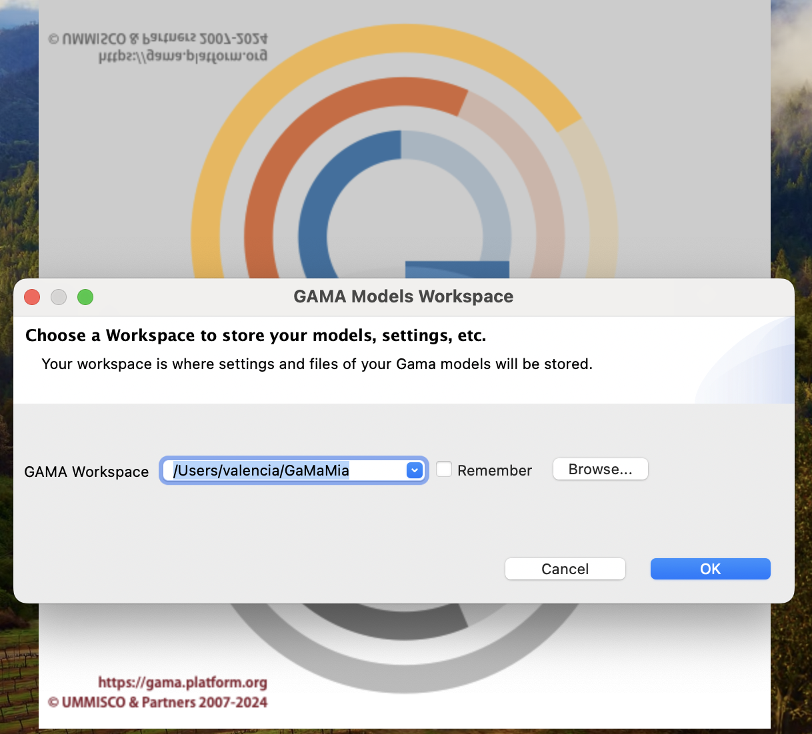
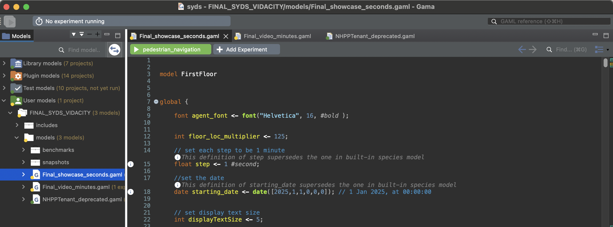

# Systems Design Studio 2025

## Vidacity PTE LTD

> Done by Team 7: Valencia Arlin Halim (1006045), Jay Edward Goh (1005871), Chong Yong Liang (1005942), Onn Hui Ning (1006132)

### Setting up GAMA Environment
Download GAMA Platform at https://gama-platform.org/download to open and run simulation models. 
After downloading, git clone the repository.
```
$ git clone https://github.com/valenciaaaalim/GaMaMia.git
```
Open GAMA and set GaMaMia as your workspace.

 

### Running Vidacity Simulation
Navigate to `FINAL_SYDS_VIDACITY/models/Final_showcase_seconds.gaml` for the real-time slow version of the showcase in simulation time of seconds.

Navigate to `FINAL_SYDS_VIDACITY/models/Final_video_minutes.gaml` for the sped up version for testing purposes.

Run all experiments by pressing the green button 'pedestrian_navigation' at the top of the window. 




### Running NHPP simulation
Navigate to `FINAL_SYDS_VIDACITY/models/NHPPTenant_sample.gaml` to visualise NHPP distribution, although values are sample values.

